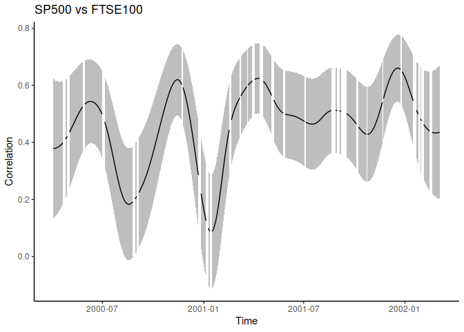
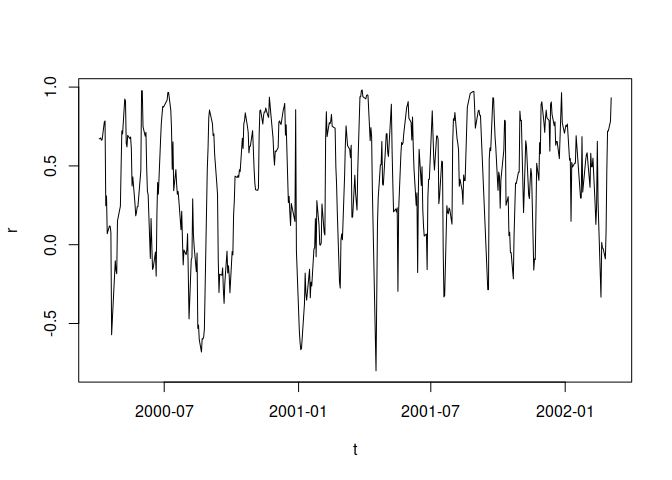

<!-- README.md is generated from README.Rmd. Please edit that file -->

# timevarcorr

<!-- badges: start -->

[](https://www.tidyverse.org/lifecycle/#experimental)
[](https://CRAN.R-project.org/package=timevarcorr)
<!-- badges: end -->

This R package is at a very early stage of development. Many key
features are missing (e.g. confidence intervals and test) and it may be
buggy. I also don’t understand much of the statistical concepts
involved. So, please only use at your own risk.

It aims at computing the correlation between 2 time-series. It performs
a non-parametric kernel smoothing (using a common bandwidth) of all
underlying componenents required for the computation of a correlation
coefficient (i.e. *x*, *y*, *x*<sup>2</sup>, *y*<sup>2</sup>,
*x* \* *y*). An automatic selection procedure for the bandwidth
parameter is implemented. Epanechnikov, Gaussian, and box kernels can be
used. Both Pearson and Spearman correlation coefficients can be
estimated.

## Installation

You can install the development version of timevarcorr from
[GitHub](https://github.com/) with:

``` r
# install.packages("remotes") ## uncomment and run if you don't have this package installed
remotes::install_github("courtiol/timevarcorr")
```

That should suffice!

Note that this package relies so far on only one direct dependency –
[lpridge](https://github.com/cran/lpridge) – which itself depends on
nothing but a plain R install.

Nonethess, in some of the examples below, I also rely on the
[tidyverse](https://github.com/tidyverse) ecosystem, so you would need
to install this as well to reproduce the content of this README:

``` r
install.packages("tidyverse")
```

## Examples

The main fonction of this package is called `tcor` and its documentation
is available here:

``` r
help(tcor, package = timevarcorr)
```

Simple example using base-R syntax:

``` r
library(timevarcorr)

d <- stockprice[1:500, ]
test <- with(d, tcor(x = SP500, y = FTSE100, t = DateID, kernel = "normal"))
#> [1] "h selected using LOO-CV = 60.9"
plot(test, type = "l", ylab = "Correlation", xlab = "Time", main = "SP500 vs FTSE100", las = 1)
```


Same example using tidyverse syntax:

``` r
library(tidyverse)

stockprice |> 
  slice(1:500) |>
  summarise(tcor(x = SP500, y = FTSE100, t = DateID, kernel = "normal")) |>
  ggplot() +
    aes(x = t, y = r) +
    geom_line() +
    labs(title = "SP500 vs FTSE100", x = "Time", y = "Correlation") +
    theme_classic()
#> [1] "h selected using LOO-CV = 60.9"
```


Alternative using `dplyr::mutate` showing gaps of observations in the
series:

``` r
stockprice |> 
  slice(1:500) |>
  mutate(r = tcor(x = SP500, y = FTSE100, t = DateID, kernel = "normal", keep.missing = TRUE)$r) |>
  ggplot() +
    aes(x = DateID, y = r) +
    geom_line() +
    labs(title = "SP500 vs FTSE100", x = "Time", y = "Correlation") +
    theme_classic()
#> [1] "h selected using LOO-CV = 60.9"
```



You can do more. For exampe, you can use other kernels, fix the
bandwidth manually, or use the Spearman’s rather than the Pearson’s
correlation coefficient:

``` r
test2 <- with(d, tcor(x = SP500, y = FTSE100, t = DateID,
                      cor.method = "spearman", kernel = "box", h = 10))
plot(test2, type = "l", ylab = "Correlation (Spearman)", xlab = "Time", las = 1)
```



## Inspiration

The inspiration for this work was the reading of the following paper:

Choi, JE., Shin, D.W. Nonparametric estimation of time varying
correlation coefficient. J. Korean Stat. Soc. 50, 333–353 (2021).
<https://doi.org/10.1007/s42952-020-00073-6>

## Devel corner

README file compiled using `devtools::build_readme()`, with the
following setup:

``` r
devtools::session_info()
#> ─ Session info ───────────────────────────────────────────────────────────────
#>  setting  value
#>  version  R version 4.1.2 (2021-11-01)
#>  os       Fedora Linux 36 (Container Image Prerelease)
#>  system   x86_64, linux-gnu
#>  ui       X11
#>  language (EN)
#>  collate  en_US.UTF-8
#>  ctype    en_US.UTF-8
#>  tz       Europe/Berlin
#>  date     2022-02-21
#>  pandoc   2.14.0.3 @ /usr/libexec/rstudio/bin/pandoc/ (via rmarkdown)
#> 
#> ─ Packages ───────────────────────────────────────────────────────────────────
#>  package     * version    date (UTC) lib source
#>  assertthat    0.2.1      2019-03-21 [3] CRAN (R 4.1.0)
#>  backports     1.4.1      2021-12-13 [3] CRAN (R 4.1.2)
#>  brio          1.1.3      2021-11-30 [3] CRAN (R 4.1.2)
#>  broom         0.7.12     2022-01-28 [3] CRAN (R 4.1.2)
#>  cachem        1.0.6      2021-08-19 [3] CRAN (R 4.1.0)
#>  callr         3.7.0      2021-04-20 [3] CRAN (R 4.1.0)
#>  cellranger    1.1.0      2016-07-27 [3] CRAN (R 4.1.0)
#>  cli           3.1.1      2022-01-20 [3] CRAN (R 4.1.2)
#>  colorspace    2.0-2      2021-06-24 [3] CRAN (R 4.1.0)
#>  crayon        1.4.2      2021-10-29 [3] CRAN (R 4.1.1)
#>  DBI           1.1.1      2021-01-15 [3] CRAN (R 4.1.0)
#>  dbplyr        2.1.1      2021-04-06 [3] CRAN (R 4.1.0)
#>  desc          1.4.0      2021-09-28 [3] CRAN (R 4.1.1)
#>  devtools      2.4.2      2021-06-07 [3] CRAN (R 4.1.0)
#>  digest        0.6.28     2021-09-23 [3] CRAN (R 4.1.1)
#>  dplyr       * 1.0.7      2021-06-18 [3] CRAN (R 4.1.0)
#>  ellipsis      0.3.2      2021-04-29 [3] CRAN (R 4.1.0)
#>  evaluate      0.14       2019-05-28 [3] CRAN (R 4.1.0)
#>  fansi         0.5.0      2021-05-25 [3] CRAN (R 4.1.0)
#>  farver        2.1.0      2021-02-28 [3] CRAN (R 4.1.0)
#>  fastmap       1.1.0      2021-01-25 [3] CRAN (R 4.1.0)
#>  forcats     * 0.5.1      2021-01-27 [3] CRAN (R 4.1.0)
#>  fs            1.5.2      2021-12-08 [3] CRAN (R 4.1.2)
#>  generics      0.1.2      2022-01-31 [3] CRAN (R 4.1.2)
#>  ggplot2     * 3.3.5      2021-06-25 [3] CRAN (R 4.1.0)
#>  glue          1.6.1      2022-01-22 [3] CRAN (R 4.1.2)
#>  gtable        0.3.0      2019-03-25 [3] CRAN (R 4.1.0)
#>  haven         2.4.3      2021-08-04 [3] CRAN (R 4.1.0)
#>  highr         0.9        2021-04-16 [3] CRAN (R 4.1.0)
#>  hms           1.1.1      2021-09-26 [3] CRAN (R 4.1.1)
#>  htmltools     0.5.2      2021-08-25 [3] CRAN (R 4.1.1)
#>  httr          1.4.2      2020-07-20 [3] CRAN (R 4.1.0)
#>  jsonlite      1.7.2      2020-12-09 [3] CRAN (R 4.1.0)
#>  knitr         1.36       2021-09-29 [3] CRAN (R 4.1.1)
#>  labeling      0.4.2      2020-10-20 [3] CRAN (R 4.1.0)
#>  lifecycle     1.0.1      2021-09-24 [3] CRAN (R 4.1.1)
#>  lubridate     1.8.0      2021-10-07 [3] CRAN (R 4.1.1)
#>  magrittr      2.0.2      2022-01-26 [3] CRAN (R 4.1.2)
#>  memoise       2.0.1      2021-11-26 [3] CRAN (R 4.1.2)
#>  modelr        0.1.8      2020-05-19 [3] CRAN (R 4.1.0)
#>  munsell       0.5.0      2018-06-12 [3] CRAN (R 4.1.0)
#>  pillar        1.7.0      2022-02-01 [3] CRAN (R 4.1.2)
#>  pkgbuild      1.3.0      2021-12-09 [3] CRAN (R 4.1.2)
#>  pkgconfig     2.0.3      2019-09-22 [3] CRAN (R 4.1.0)
#>  pkgload       1.2.4      2021-11-30 [3] CRAN (R 4.1.2)
#>  prettyunits   1.1.1      2020-01-24 [3] CRAN (R 4.1.0)
#>  processx      3.5.2      2021-04-30 [3] CRAN (R 4.1.0)
#>  ps            1.6.0      2021-02-28 [3] CRAN (R 4.1.0)
#>  purrr       * 0.3.4      2020-04-17 [3] CRAN (R 4.1.0)
#>  R6            2.5.1      2021-08-19 [3] CRAN (R 4.1.0)
#>  Rcpp          1.0.7      2021-07-07 [3] CRAN (R 4.1.0)
#>  readr       * 2.1.2      2022-01-30 [3] CRAN (R 4.1.2)
#>  readxl        1.3.1      2019-03-13 [3] CRAN (R 4.1.0)
#>  remotes       2.4.2      2021-11-30 [3] CRAN (R 4.1.2)
#>  reprex        2.0.1      2021-08-05 [3] CRAN (R 4.1.0)
#>  rlang         1.0.0      2022-01-26 [3] CRAN (R 4.1.2)
#>  rmarkdown     2.11       2021-09-14 [3] CRAN (R 4.1.1)
#>  rprojroot     2.0.2      2020-11-15 [3] CRAN (R 4.1.0)
#>  rstudioapi    0.13       2020-11-12 [3] CRAN (R 4.1.0)
#>  rvest         1.0.2      2021-10-16 [3] CRAN (R 4.1.1)
#>  scales        1.1.1      2020-05-11 [3] CRAN (R 4.1.0)
#>  sessioninfo   1.2.2      2021-12-06 [3] CRAN (R 4.1.2)
#>  stringi       1.7.4      2021-08-25 [3] CRAN (R 4.1.1)
#>  stringr     * 1.4.0      2019-02-10 [3] CRAN (R 4.1.0)
#>  testthat      3.1.2      2022-01-20 [3] CRAN (R 4.1.2)
#>  tibble      * 3.1.4      2021-08-25 [3] CRAN (R 4.1.1)
#>  tidyr       * 1.2.0      2022-02-01 [3] CRAN (R 4.1.2)
#>  tidyselect    1.1.1      2021-04-30 [3] CRAN (R 4.1.0)
#>  tidyverse   * 1.3.1      2021-04-15 [3] CRAN (R 4.1.0)
#>  timevarcorr * 0.0.0.9000 2022-02-21 [1] local
#>  tzdb          0.2.0      2021-10-27 [3] CRAN (R 4.1.1)
#>  usethis       2.1.5      2021-12-09 [3] CRAN (R 4.1.2)
#>  utf8          1.2.2      2021-07-24 [3] CRAN (R 4.1.0)
#>  vctrs         0.3.8      2021-04-29 [3] CRAN (R 4.1.0)
#>  withr         2.4.3      2021-11-30 [3] CRAN (R 4.1.2)
#>  xfun          0.27       2021-10-18 [3] CRAN (R 4.1.1)
#>  xml2          1.3.3      2021-11-30 [3] CRAN (R 4.1.2)
#>  yaml          2.2.2      2022-01-25 [3] CRAN (R 4.1.2)
#> 
#>  [1] /tmp/Rtmp9lSeJr/temp_libpath8c79d6cfd5fd9
#>  [2] /home/alex/R/x86_64-redhat-linux-gnu-library/4.1
#>  [3] /usr/local/lib/R/library
#>  [4] /usr/lib64/R/library
#>  [5] /usr/share/R/library
#> 
#> ──────────────────────────────────────────────────────────────────────────────
```
