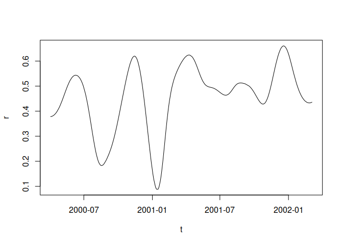

<!-- README.md is generated from README.Rmd. Please edit that file -->

# timevarcorr

<!-- badges: start -->

[](https://CRAN.R-project.org/package=timevarcorr)
[](https://lifecycle.r-lib.org/articles/stages.html#experimental)
<!-- badges: end -->

This R package aims at computing the correlation between 2 time-series
following the method described in the following paper:

Choi, JE., Shin, D.W. Nonparametric estimation of time varying
correlation coefficient. J. Korean Stat. Soc. 50, 333–353 (2021).
<https://doi.org/10.1007/s42952-020-00073-6>

The chief idea is to perform a non-parametric kernel smoothing (using a
common bandwidth) of all underlying components required for the
computation of a correlation coefficient (i.e. $x$, $y$, $x^2$, $y^2$,
$x*y$).

The automatic selection procedure for the bandwidth parameter proposed
in the paper is implemented in this package. The same goes for the
computation of confidence intervals.

We also implemented the possibility to use Epanechnikov, Gaussian, or
box kernels, as well as to estimate either the Pearson or the Spearman
correlation coefficient.

## Installation

You can install the development version of timevarcorr from
[GitHub](https://github.com/) with:

``` r
# install.packages("remotes") ## uncomment and run if you don't have this package installed
remotes::install_github("courtiol/timevarcorr")
```

That should suffice!

Note that this package relies so far on only one direct dependency –
[lpridge](https://github.com/cran/lpridge) – which itself depends on
nothing but a plain R install.

Nonetheless, in some of the examples below, I also rely on the
[tidyverse](https://github.com/tidyverse) ecosystem, so you would need
to install this as well to reproduce the content of this README:

``` r
install.packages("tidyverse")
```

## Examples

The main function of this package is called `tcor` and its documentation
is available here:

``` r
help(tcor, package = timevarcorr)
```

Very simple example using base-R syntax:

``` r
library(timevarcorr)
#> timevarcorr loaded; type ?tcor for help on this package.

d <- stockprice[1:500, ]
example1 <- with(d, tcor(x = SP500, y = FTSE100, t = DateID, kernel = "normal"))
#> 
#> You may set `nb.cores` to a number higher than 1 for faster computation.
#> [1] "h selected using LOO-CV = 60.9"
plot(example1, type = "l")
```



Same example using tidyverse syntax (with confidence interval):

``` r
library(tidyverse)

d |> 
  summarise(tcor(x = SP500, y = FTSE100, t = DateID,
                 kernel = "normal", CI = TRUE)) |>
  ggplot() +
    aes(x = t, y = r, ymin = lwr, ymax = upr) +
    geom_ribbon(fill = "grey") +
    geom_line() +
    labs(title = "SP500 vs FTSE100", x = "Time", y = "Correlation") +
    theme_classic()
#> [1] "h selected using LOO-CV = 60.9"
```


Same example showing gaps of observations in the time series:

``` r
d |> 
  summarise(tcor(x = SP500, y = FTSE100, t = DateID,
                 kernel = "normal", CI = TRUE, keep.missing = TRUE)) |>
  ggplot() +
    aes(x = t, y = r, ymin = lwr, ymax = upr) +
    geom_ribbon(fill = "grey") +
    geom_line() +
    labs(title = "SP500 vs FTSE100", x = "Time", y = "Correlation") +
    theme_classic()
#> 
#> You may set `nb.cores` to a number higher than 1 for faster computation.
#> [1] "h selected using LOO-CV = 60.9"
```


You can do more. For example, you can use other kernels, fix the
bandwidth manually, or use the Spearman’s rather than the Pearson’s
correlation coefficient:

``` r
example2 <- with(d, tcor(x = SP500, y = FTSE100, t = DateID,
                 cor.method = "spearman", kernel = "box", h = 10))
plot(example2, type = "l")
```


You can also test the difference in correlation coefficients between two
time points:

``` r
example3 <- with(d, tcor(x = SP500, y = FTSE100, t = DateID, kernel = "normal", CI = TRUE))
#> 
#> You may set `nb.cores` to a number higher than 1 for faster computation.
#> [1] "h selected using LOO-CV = 60.9"
equality_test(example3, t1 = "2000-05-02", t2 = "2001-05-02")
#>           t1        r1         t2        r2   delta_r SE_delta_r   T_stat  df
#> 1 2000-05-02 0.4354486 2001-05-02 0.5721993 0.1367507  0.1224749 1.116561 910
#>           p
#> 1 0.2644768
```

Or you can test if specific time points (or all) differ from a reference
value:

``` r
ref_test(example3, t = c("2000-05-02", "2001-05-02"), r_ref = 0.5)
#>            t         r r_ref     delta_r SE_delta_r     T_stat  df         p
#> 1 2000-05-02 0.4354486   0.5 -0.06455140 0.10082726 -0.6402177 910 0.5221922
#> 2 2001-05-02 0.5721993   0.5  0.07219934 0.06952677  1.0384394 910 0.2993414
#>   p_adjustment
#> 1         none
#> 2         none
```

## Devel corner

README file compiled using `devtools::build_readme()`, with the
following setup:

``` r
devtools::session_info()
#> ─ Session info ───────────────────────────────────────────────────────────────
#>  setting  value
#>  version  R version 4.3.1 (2023-06-16)
#>  os       Ubuntu 22.04.3 LTS
#>  system   x86_64, linux-gnu
#>  ui       X11
#>  language (EN)
#>  collate  en_US.UTF-8
#>  ctype    en_US.UTF-8
#>  tz       Europe/Berlin
#>  date     2023-11-04
#>  pandoc   3.1.8 @ /usr/lib/rstudio/resources/app/bin/quarto/bin/tools/x86_64/ (via rmarkdown)
#> 
#> ─ Packages ───────────────────────────────────────────────────────────────────
#>  package     * version    date (UTC) lib source
#>  bspm          0.5.5      2023-08-22 [2] CRAN (R 4.3.1)
#>  cachem        1.0.8      2023-05-01 [3] RSPM (R 4.2.0)
#>  callr         3.7.3      2022-11-02 [3] RSPM (R 4.2.0)
#>  cli           3.6.1      2023-03-23 [3] RSPM (R 4.2.0)
#>  colorspace    2.1-0      2023-01-23 [3] RSPM (R 4.2.0)
#>  crayon        1.5.2      2022-09-29 [3] RSPM (R 4.2.0)
#>  devtools      2.4.5      2022-10-11 [3] RSPM (R 4.2.0)
#>  digest        0.6.33     2023-07-07 [3] RSPM (R 4.2.0)
#>  dplyr       * 1.1.3      2023-09-03 [3] RSPM (R 4.3.0)
#>  ellipsis      0.3.2      2021-04-29 [3] RSPM (R 4.2.0)
#>  evaluate      0.23       2023-11-01 [3] RSPM (R 4.3.0)
#>  fansi         1.0.5      2023-10-08 [3] RSPM (R 4.3.0)
#>  farver        2.1.1      2022-07-06 [3] RSPM (R 4.2.0)
#>  fastmap       1.1.1      2023-02-24 [3] RSPM (R 4.2.0)
#>  forcats     * 1.0.0      2023-01-29 [3] RSPM (R 4.2.0)
#>  fs            1.6.3      2023-07-20 [3] RSPM (R 4.2.0)
#>  generics      0.1.3      2022-07-05 [3] RSPM (R 4.2.0)
#>  ggplot2     * 3.4.4      2023-10-12 [3] RSPM (R 4.3.0)
#>  glue          1.6.2      2022-02-24 [3] RSPM (R 4.2.0)
#>  gtable        0.3.4      2023-08-21 [3] RSPM (R 4.2.0)
#>  highr         0.10       2022-12-22 [3] RSPM (R 4.2.0)
#>  hms           1.1.3      2023-03-21 [3] RSPM (R 4.2.0)
#>  htmltools     0.5.6.1    2023-10-06 [3] RSPM (R 4.3.0)
#>  htmlwidgets   1.6.2      2023-03-17 [3] RSPM (R 4.2.0)
#>  httpuv        1.6.12     2023-10-23 [3] RSPM (R 4.3.0)
#>  knitr         1.45       2023-10-30 [3] RSPM (R 4.3.0)
#>  labeling      0.4.3      2023-08-29 [3] RSPM (R 4.2.0)
#>  later         1.3.1      2023-05-02 [3] RSPM (R 4.2.0)
#>  lifecycle     1.0.3      2022-10-07 [3] RSPM (R 4.2.0)
#>  lubridate   * 1.9.3      2023-09-27 [3] RSPM (R 4.3.0)
#>  magrittr      2.0.3      2022-03-30 [3] RSPM (R 4.2.0)
#>  memoise       2.0.1      2021-11-26 [3] RSPM (R 4.2.0)
#>  mime          0.12       2021-09-28 [3] RSPM (R 4.2.0)
#>  miniUI        0.1.1.1    2018-05-18 [3] RSPM (R 4.2.0)
#>  munsell       0.5.0      2018-06-12 [3] RSPM (R 4.2.0)
#>  pillar        1.9.0      2023-03-22 [3] RSPM (R 4.2.0)
#>  pkgbuild      1.4.2      2023-06-26 [3] RSPM (R 4.2.0)
#>  pkgconfig     2.0.3      2019-09-22 [3] RSPM (R 4.2.0)
#>  pkgload       1.3.3      2023-09-22 [3] RSPM (R 4.3.0)
#>  prettyunits   1.2.0      2023-09-24 [3] RSPM (R 4.3.0)
#>  processx      3.8.2      2023-06-30 [3] RSPM (R 4.2.0)
#>  profvis       0.3.8      2023-05-02 [3] RSPM (R 4.2.0)
#>  promises      1.2.1      2023-08-10 [3] RSPM (R 4.2.0)
#>  ps            1.7.5      2023-04-18 [3] RSPM (R 4.3.0)
#>  purrr       * 1.0.2      2023-08-10 [3] RSPM (R 4.2.0)
#>  R6            2.5.1      2021-08-19 [3] RSPM (R 4.2.0)
#>  Rcpp          1.0.11     2023-07-06 [3] RSPM (R 4.2.0)
#>  readr       * 2.1.4      2023-02-10 [3] RSPM (R 4.2.0)
#>  remotes       2.4.2.1    2023-07-18 [3] RSPM (R 4.2.0)
#>  rlang         1.1.1      2023-04-28 [3] RSPM (R 4.2.0)
#>  rmarkdown     2.25       2023-09-18 [3] RSPM (R 4.3.0)
#>  rstudioapi    0.15.0     2023-07-07 [3] RSPM (R 4.2.0)
#>  scales        1.2.1      2022-08-20 [3] RSPM (R 4.2.0)
#>  sessioninfo   1.2.2      2021-12-06 [3] RSPM (R 4.2.0)
#>  shiny         1.7.5.1    2023-10-14 [3] RSPM (R 4.3.0)
#>  stringi       1.7.12     2023-01-11 [3] RSPM (R 4.2.0)
#>  stringr     * 1.5.0      2022-12-02 [3] RSPM (R 4.2.0)
#>  tibble      * 3.2.1      2023-03-20 [3] RSPM (R 4.3.0)
#>  tidyr       * 1.3.0      2023-01-24 [3] RSPM (R 4.2.0)
#>  tidyselect    1.2.0      2022-10-10 [3] RSPM (R 4.2.0)
#>  tidyverse   * 2.0.0      2023-02-22 [3] RSPM (R 4.2.0)
#>  timechange    0.2.0      2023-01-11 [3] RSPM (R 4.2.0)
#>  timevarcorr * 0.0.0.9005 2023-11-04 [1] local
#>  tzdb          0.4.0      2023-05-12 [3] RSPM (R 4.2.0)
#>  urlchecker    1.0.1      2021-11-30 [3] RSPM (R 4.2.0)
#>  usethis       2.2.2      2023-07-06 [3] RSPM (R 4.2.0)
#>  utf8          1.2.4      2023-10-22 [3] RSPM (R 4.3.0)
#>  vctrs         0.6.4      2023-10-12 [3] RSPM (R 4.3.0)
#>  withr         2.5.2      2023-10-30 [3] RSPM (R 4.3.0)
#>  xfun          0.41       2023-11-01 [3] RSPM (R 4.3.0)
#>  xtable        1.8-4      2019-04-21 [3] RSPM (R 4.2.0)
#>  yaml          2.3.7      2023-01-23 [3] RSPM (R 4.2.0)
#> 
#>  [1] /home/courtiol/R/x86_64-pc-linux-gnu-library/4.3
#>  [2] /usr/local/lib/R/site-library
#>  [3] /usr/lib/R/site-library
#>  [4] /usr/lib/R/library
#> 
#> ──────────────────────────────────────────────────────────────────────────────
```
